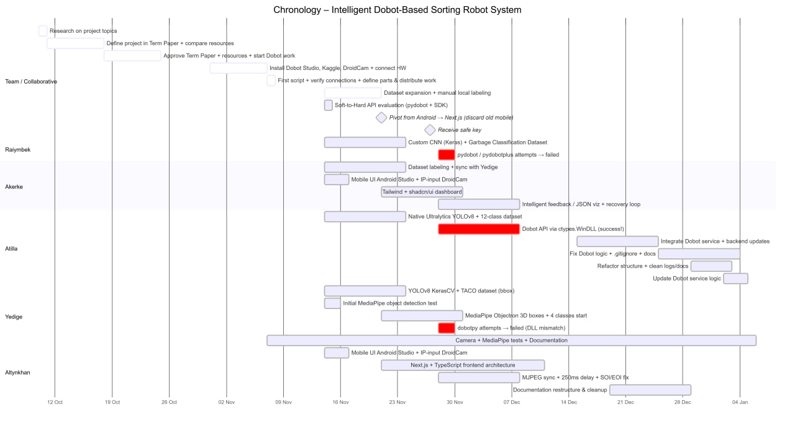
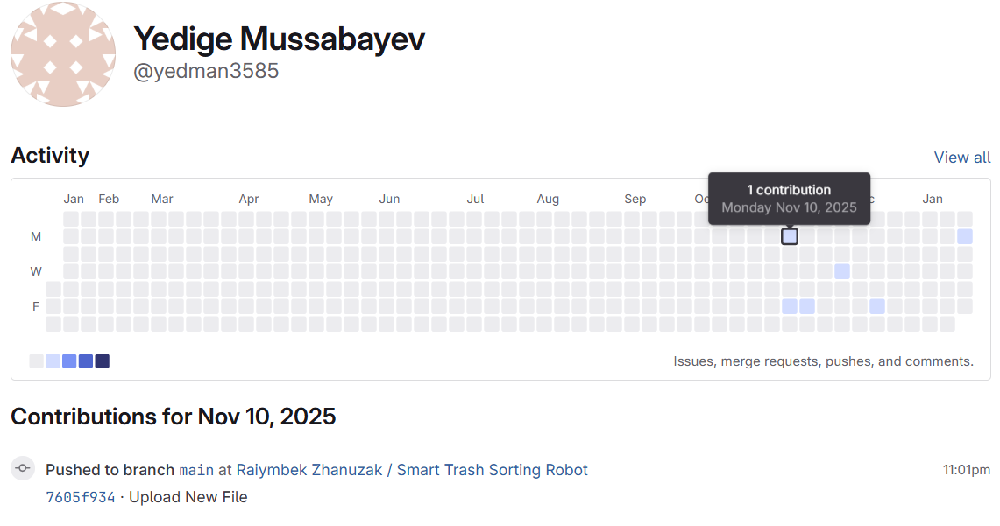
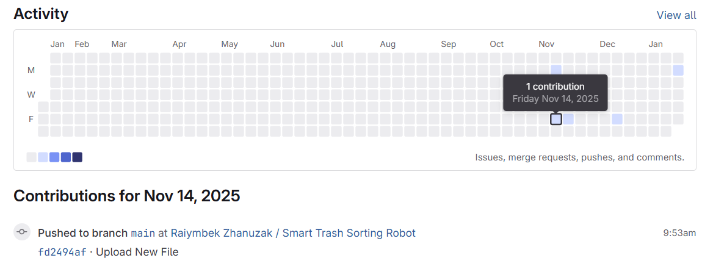
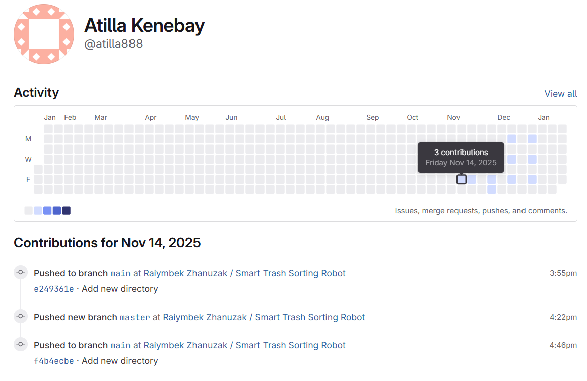
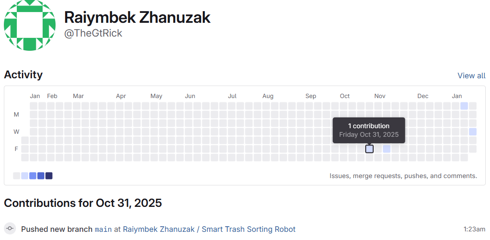
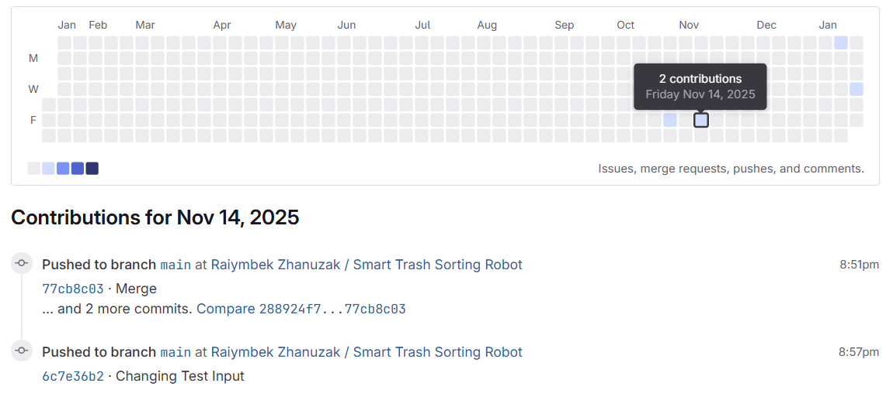
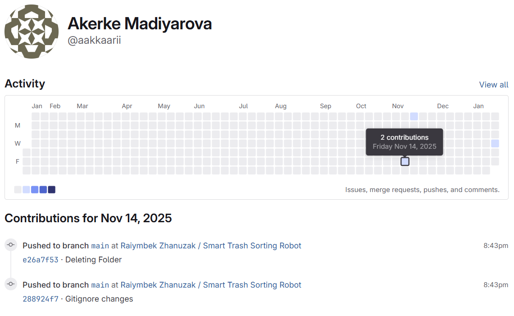

# Integrated Robotic Waste Sorting System 

This project implements an automated waste classification and sorting line using a **Dobot Magician** robotic arm, a **Niryo conveyor system**, and **YOLOv8** computer vision.

---

## ⚠️ Important Note on Project Structure
This repository contains two main branches:

1.  **`master` (Final Release):** Contains only the production-ready code, the final optimized model, and the stable backend. 
     **https://gitlab.hof-university.de/TheGtRick/Applied_Robotics/-/tree/master?ref_type=heads**
2.  **`main` (Development Archive):** This current branch. It serves as a workspace and archive, containing initial prototypes, experimental Keras models, and development scripts.

---

##  File Organization (`main` branch) - Experimental Branch (Final project files are in the master branch)

During the development process, we explored several architectures. The files highlighted below are part of the **final system**, while others (e.g., Keras/EfficientNet files) are preserved as part of our research history.

###  Main Experimental Folders
The following files were part of our research but are **not** used in the final sorting pipeline:
* `keras_model`: Experimental Keras-based EfficientNetV2S. Although the model was lightweight in terms of parameters, the Fused-MBConv architecture proved to be computationally "expensive" on our inference hardware.
* `KERAS_YOLO`: This was a hybrid approach aimed at implementing Object Detection (finding coordinates + classification) within the KerasCV ecosystem. We used a Decoupled Head architecture to predict bounding boxes for the waste. The task of spatial localization (Object Detection) turned out to be redundant.
* `camera` : MediaPipe Objectron was used to obtain 6DoF (six degrees of freedom) objects. This would allow the system to determine not only the waste class but also its spatial orientation. However, due to the limited set of pre-trained categories in Objectron, a decision was made to use the YOLOv8 + Fixed Coordinate Mapping combination, as it is more stable and adaptable to specific types of waste.
* `Android_app` : A Kotlin-based Android application designed to serve as a mobile control panel. Handling MJPEG streams via Glide often led to Application Not Responding errors. The web version provided a more stable environment. 
* `utils + main.py` : First attempts to transfer Dobot Magician Coordinates to pixels

##  Team & Git History
Team Work Distribution:  
* Complete chronology of activities and commits is described in the https://gitlab.hof-university.de/TheGtRick/Applied_Robotics/-/blob/main/Chronology_Robotics___2_.pdf?ref_type=heads
* Below is Timeline of work on released/unreleased ideas by each member: 

* Due to the significant size of the project (datasets, model weights, and video assets), the GitLab repository reached its storage limit. To maintain repository health, the Git history probably was reset and the repository was cleared of large cached files. 
Nevertheless, the activity of team members themselves is depicted as folows: 

## 🛠 Tech Stack
* **Vision:** YOLOv8-cls (PyTorch -> ONNX)
* **Backends:** FastAPI (Python) & Node.js
* **Frontend:** Next.js
* **Robotics:** Dobot Magician & Niryo Conveyor
* **Communication:** REST API & MJPEG Streaming